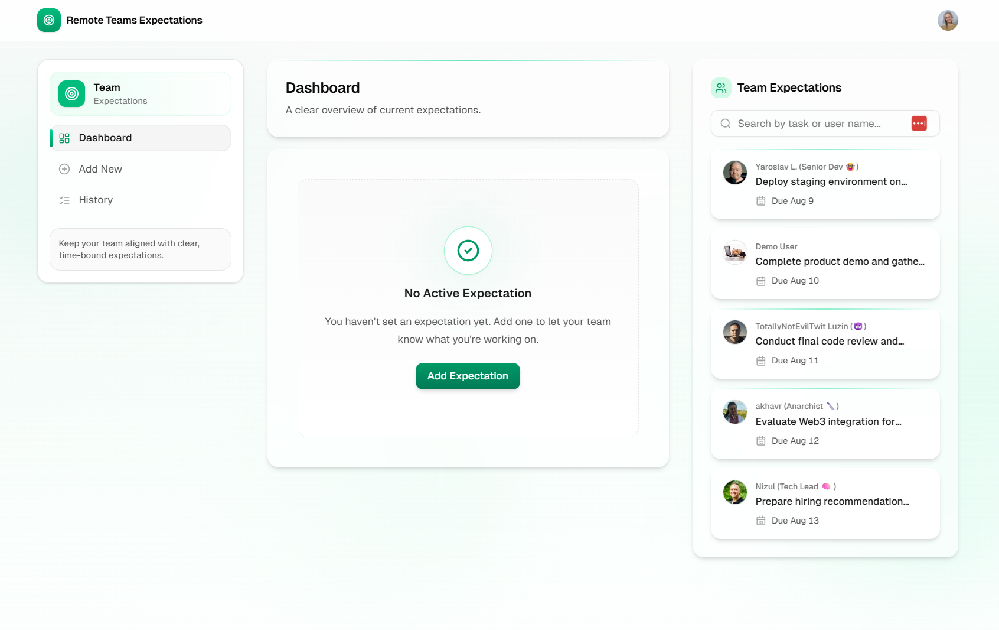

# Remote Teams Expectations Tracker

A simple, focused tool for remote teams to share what they're working on and when they'll be done.



## 🚀 Live Demo

**Check out the POC: [https://tracker.kindsolutions.net/](https://tracker.kindsolutions.net/)**

## What is this?

In remote teams, it's hard to know what everyone is working on. This app solves that with a dead-simple approach:
- Each person sets ONE current expectation
- Shows what they're doing and when they'll finish
- Everyone sees the team's focus at a glance
- Track history of completed work

## POC Status

This is a **Proof of Concept** following the 80/20 rule. Like an artist sketching basic shapes before adding details, this MVP demonstrates the core concept before implementing full features.

**Current state**: Basic UI and mock data only  
**Next steps**: Implement authentication, persistence, and real-time updates based on client feedback

## Development Approach

Following lean startup principles:
1. Build minimal viable version
2. Deploy and get real feedback
3. Shape implementation to actual needs
4. Avoid over-engineering

This approach ensures we build what teams actually need, not what we think they need.

## Tech Stack

- **Frontend**: Next.js 15 + React 19, TypeScript, Tailwind CSS
- **Authentication**: Clerk (with webhook sync)
- **Database**: PostgreSQL with Drizzle ORM
- **Testing**: Playwright for E2E and API tests
- **Deployment**: Coolify (self-hosted)

## Quick Start

### Prerequisites
- Node.js 18+
- PostgreSQL database
- Clerk account (free tier works)
- ngrok account (for local webhook testing)

### Setup
```bash
# 1. Clone and install
git clone https://github.com/your-org/awesome-remote-teams-expectations.git
cd awesome-remote-teams-expectations
make install

# 2. Configure environment
cp .env.example .env
# Edit .env with your credentials

# 3. Setup database
make db-update

# 4. Run development server
make dev
```

For complete setup including webhooks and testing, see [Complete Setup Guide](docs/setup/complete-setup-guide.md).

## Development Commands

```bash
make dev              # Start development server
make test            # Run all tests
make db-studio       # Open database GUI
make help            # Show all available commands
```

## Getting Started

### Quick Setup
1. Clone the repository
2. Install dependencies: `npm install`
3. Set up environment variables: See **[Setup Guide](./docs/setup/README.md)**
4. Run development server: `npm run dev`

### Setup Guides
- **[Complete Setup Guide](./docs/setup/README.md)** - Step-by-step instructions
- **[Environment Variables](./docs/setup/env-variables.md)** - All configuration options
- **[Testing Setup](./docs/setup/testing.md)** - Run tests without external services

## Documentation

- **Setup**: `/docs/setup/` - Getting started guides
- **Testing**: [TDD Documentation](docs/testing/docmap.md) - Test-driven development approach and E2E tests
- **Architecture**: [Overview](docs/entrypoint.md)
- **API**: [Documentation](docs/backend/docmap.md)
