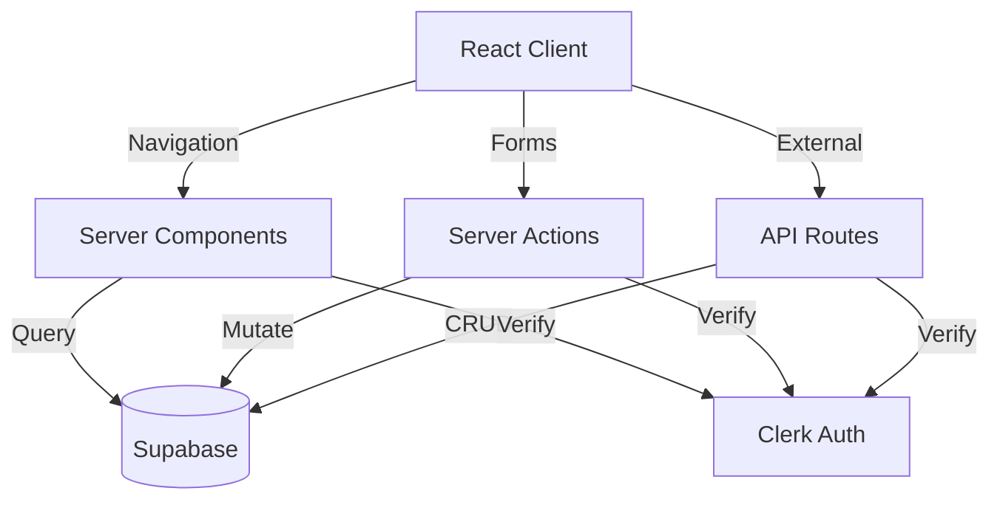

# API Architecture

## Service Architecture Pattern

### Next.js App Router with Server Actions
Primary pattern leveraging Next.js 15 capabilities:
- Server Components for data fetching
- Server Actions for mutations
- API routes for external integrations

### Communication Flow


## Server Actions

### Expectation Management

```typescript
// app/actions/expectations.ts

async function createExpectation(data: {
  title: string
  estimatedCompletion: Date
}): Promise<ActionResult<Expectation>>

async function updateExpectation(
  id: string,
  data: {
    title?: string
    estimatedCompletion?: Date
  }
): Promise<ActionResult<Expectation>>

async function deleteExpectation(id: string): Promise<ActionResult<void>>

async function completeExpectation(id: string): Promise<ActionResult<Expectation>>
```

### Action Result Pattern
```typescript
type ActionResult<T> = 
  | { success: true; data: T }
  | { success: false; error: string }
```

## API Routes (External Access)

### OpenAPI Specification

```yaml
openapi: 3.0.0
info:
  title: Remote Teams Expectations API
  version: 1.0.0
  description: API for managing team expectations

security:
  - ClerkAuth: []

paths:
  /api/expectations:
    get:
      summary: List all expectations
      parameters:
        - name: status
          in: query
          schema:
            type: string
            enum: [active, completed, all]
          default: all
      responses:
        200:
          description: List of expectations
          content:
            application/json:
              schema:
                type: array
                items:
                  $ref: '#/components/schemas/ExpectationWithUser'
    
    post:
      summary: Create new expectation
      requestBody:
        required: true
        content:
          application/json:
            schema:
              $ref: '#/components/schemas/CreateExpectation'
      responses:
        201:
          description: Created expectation
          content:
            application/json:
              schema:
                $ref: '#/components/schemas/Expectation'
        400:
          description: User already has active expectation

  /api/expectations/{id}:
    put:
      summary: Update expectation
      parameters:
        - name: id
          in: path
          required: true
          schema:
            type: string
            format: uuid
      requestBody:
        content:
          application/json:
            schema:
              $ref: '#/components/schemas/UpdateExpectation'
      responses:
        200:
          description: Updated expectation
        403:
          description: Not authorized
        404:
          description: Not found

    delete:
      summary: Delete expectation
      parameters:
        - name: id
          in: path
          required: true
          schema:
            type: string
            format: uuid
      responses:
        204:
          description: Deleted
        403:
          description: Not authorized

  /api/expectations/{id}/complete:
    post:
      summary: Mark expectation as complete
      parameters:
        - name: id
          in: path
          required: true
          schema:
            type: string
            format: uuid
      responses:
        200:
          description: Completed expectation
        403:
          description: Not authorized

components:
  schemas:
    CreateExpectation:
      type: object
      required: [title, estimatedCompletion]
      properties:
        title:
          type: string
          minLength: 1
          maxLength: 500
        estimatedCompletion:
          type: string
          format: date-time

    UpdateExpectation:
      type: object
      properties:
        title:
          type: string
          minLength: 1
          maxLength: 500
        estimatedCompletion:
          type: string
          format: date-time

    Expectation:
      allOf:
        - $ref: '#/components/schemas/CreateExpectation'
        - type: object
          required: [id, userId, createdAt, isDone, updatedAt]
          properties:
            id:
              type: string
              format: uuid
            userId:
              type: string
              format: uuid
            createdAt:
              type: string
              format: date-time
            isDone:
              type: boolean
            doneAt:
              type: string
              format: date-time
              nullable: true
            updatedAt:
              type: string
              format: date-time

    ExpectationWithUser:
      allOf:
        - $ref: '#/components/schemas/Expectation'
        - type: object
          required: [user]
          properties:
            user:
              $ref: '#/components/schemas/User'

    User:
      type: object
      required: [id, email, name, createdAt, updatedAt]
      properties:
        id:
          type: string
          format: uuid
        email:
          type: string
          format: email
        name:
          type: string
        avatarUrl:
          type: string
          format: uri
          nullable: true
        createdAt:
          type: string
          format: date-time
        updatedAt:
          type: string
          format: date-time

  securitySchemes:
    ClerkAuth:
      type: http
      scheme: bearer
      bearerFormat: JWT
```

## Service Boundaries

### Frontend Layer
- React Server/Client Components
- Form handling with Server Actions
- Real-time updates via polling/SSE

### Application Layer
- Business logic in Server Actions
- Validation with Zod schemas
- Error handling and user feedback

### Data Layer
- Drizzle ORM for type-safe queries
- Supabase for persistence
- Transaction management

### External Integration
- Clerk for authentication
- Webhook endpoints for events
- API routes for third-party access