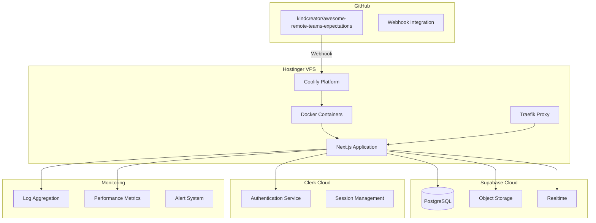

# Infrastructure Blueprint

## Core Infrastructure Components

### Application Layer


## Component Specifications

### 1. Application Server (Hostinger VPS with Coolify)
**Purpose**: Self-hosted Next.js application deployment platform

**Coolify Configuration**:
- Self-hosted PaaS solution
- Docker-based container orchestration
- Automatic SSL certificate management
- Zero-downtime deployments

**VPS Specifications**:
- Ubuntu 22.04 LTS
- 4 vCPUs minimum
- 8GB RAM recommended
- 50GB SSD storage
- 1Gbps network connection

**Deployment Pipeline**:
1. Git push to `main` branch
2. GitHub webhook triggers Coolify
3. Coolify pulls latest code
4. Nixpacks analyzes and builds project
5. Docker image creation
6. Container deployment
7. Traefik routes traffic to new container

**Requirements**:
- Node.js 18+ runtime in Docker
- 2GB memory per container
- Environment variable management via Coolify
- Persistent volume for uploads

### 2. Database (Supabase PostgreSQL)
**Purpose**: Primary data persistence layer

**Characteristics**:
- Managed PostgreSQL instance
- Row-level security (RLS)
- Built-in connection pooling
- Automatic backups

**Specifications**:
- PostgreSQL 15+
- 2 vCPUs, 4GB RAM (minimum)
- 10GB storage (scalable)
- Point-in-time recovery

**Schema Management**:
- Drizzle ORM migrations
- Version-controlled schema
- Rollback capabilities
- Partial unique index for business rules enforcement
- Performance indexes for common queries

### 3. Authentication (Clerk)
**Purpose**: Complete authentication and user management

**Characteristics**:
- Hosted authentication service
- JWT token management
- MFA support
- Webhook events

**Integration Points**:
- Frontend: Clerk React components
- Backend: JWT verification middleware
- Webhooks: User sync endpoints

### 4. Object Storage (Supabase Storage)
**Purpose**: User avatar and file storage

**Characteristics**:
- S3-compatible API
- CDN integration
- Access control via RLS
- Image transformation

**Buckets**:
- `avatars`: Public read, authenticated write
- `exports`: Private, user-scoped access

### 5. Real-time Updates (Supabase Realtime)
**Purpose**: Live updates for team dashboard

**Characteristics**:
- WebSocket connections
- PostgreSQL CDC (Change Data Capture)
- Channel-based subscriptions
- Presence tracking

**Channels**:
- `expectations:active`: All active expectations
- `expectations:user:{id}`: User-specific updates

### 6. Caching Layer
**Purpose**: Performance optimization

**Traefik Cache Configuration**:
- Static assets: Cache-Control headers (1 year)
- API responses: 60 seconds (active expectations)
- User data: No cache
- History: 5 minutes cache

**Application-Level Caching**:
- Next.js built-in caching
- Server Component cache
- Static generation where possible
- Cache invalidation on data mutations

### 7. Background Jobs
**Purpose**: Scheduled tasks and maintenance

**Implementation Options**:
1. **Node Cron**: In-process scheduling
   ```javascript
   // Simple cron jobs within Next.js
   import cron from 'node-cron'
   
   // Daily archive task
   cron.schedule('0 0 * * *', archiveOldExpectations)
   ```

2. **Docker Cron Container**: Separate service
   - Isolated cron container
   - Calls API endpoints
   - Managed by Coolify

**Scheduled Jobs**:
- Daily: Archive old completed expectations
- Hourly: Send reminder notifications
- Weekly: Generate team reports

## Environment Configuration

### Development
```env
# Database
DATABASE_URL=postgresql://...

# Authentication
CLERK_SECRET_KEY=sk_test_...
NEXT_PUBLIC_CLERK_PUBLISHABLE_KEY=pk_test_...

# Supabase
SUPABASE_URL=https://xxx.supabase.co
SUPABASE_ANON_KEY=eyJhbG...
SUPABASE_SERVICE_KEY=eyJhbG...
```

### Production
- Managed via Coolify environment variables
- Secrets stored in Coolify's encrypted vault
- Environment-specific configurations
- Automatic injection into Docker containers

## Scaling Characteristics

### Horizontal Scaling
- **Application**: Manual scaling via Coolify (add containers)
- **Load Balancing**: Traefik automatic service discovery
- **Database**: Supabase read replicas
- **Storage**: Unlimited via Supabase
- **Auth**: Handled by Clerk cloud

### Performance Targets
- Page load: < 3 seconds (P95)
- API response: < 200ms (P95)
- Database query: < 50ms (P95)
- Concurrent users: 10,000+

## Monitoring Requirements

### Application Monitoring
- Error tracking (Sentry)
- Performance monitoring
- Custom business metrics
- User behavior analytics

### Infrastructure Monitoring
- Uptime monitoring (99.9% SLA)
- Database performance
- API rate limit tracking
- Cost optimization alerts

### Logging Strategy
- Structured JSON logging
- Log levels: ERROR, WARN, INFO
- Retention: 30 days
- PII scrubbing

## Deployment Configuration

### Coolify Setup
```yaml
# Docker Compose generated by Coolify
services:
  app:
    build:
      context: .
      dockerfile: Dockerfile
    environment:
      - NODE_ENV=production
    volumes:
      - uploads:/app/uploads
    healthcheck:
      test: ["CMD", "curl", "-f", "http://localhost:3000/api/health"]
      interval: 30s
      timeout: 10s
      retries: 3
```

### GitHub Integration
- **Repository**: https://github.com/kindcreator/awesome-remote-teams-expectations
- **Branch**: main (production)
- **Webhook**: Automatic deployment on push
- **Build Command**: `pnpm build`
- **Start Command**: `pnpm start`

## Disaster Recovery

### Backup Strategy
- **VPS**: Daily snapshots via Hostinger
- **Database**: Supabase automated backups
- **Code**: GitHub repository
- **Secrets**: Coolify encrypted backups
- **Uploads**: Volume backups

### Recovery Targets
- RPO (Recovery Point Objective): 24 hours
- RTO (Recovery Time Objective): 2 hours
- Degraded mode: Read-only access

### Failover Plan
1. **VPS Failure**: Restore from Hostinger snapshot
2. **Coolify Failure**: Manual Docker deployment
3. **Database**: Supabase automatic failover
4. **DNS**: Update A records if IP changes