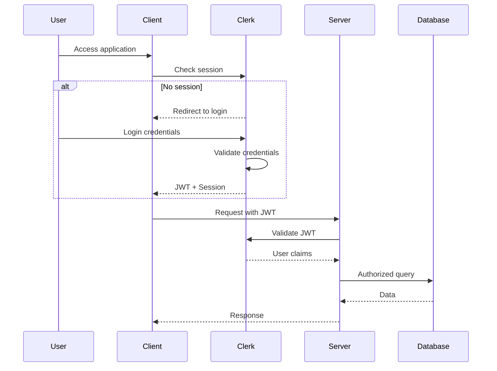

# Security Architecture

## Authentication Strategy

### Primary Authentication: Clerk
Leveraging Clerk for complete authentication solution:
- Email/password authentication
- Session management
- JWT token generation
- Multi-factor authentication (optional)

### Authentication Flow


## Authorization Model

### Role-Based Access Control (RBAC)
Simple role model for initial implementation:

```typescript
enum UserRole {
  USER = "user",
  ADMIN = "admin"
}

interface AuthContext {
  userId: string
  email: string
  role: UserRole
  sessionId: string
}
```

### Permission Matrix

| Action | Own Expectation | Others' Expectation | Admin Override |
|--------|----------------|-------------------|----------------|
| View | ✓ | ✓ | ✓ |
| Create | ✓ | ✗ | ✓ |
| Update | ✓ | ✗ | ✓ |
| Delete | ✓ | ✗ | ✓ |
| Complete | ✓ | ✗ | ✓ |

### Authorization Rules

```typescript
// Authorization checks for Server Actions
async function authorizeExpectationAction(
  userId: string,
  expectationId: string,
  action: 'update' | 'delete' | 'complete'
): Promise<boolean> {
  // Check ownership
  const expectation = await getExpectation(expectationId)
  return expectation.userId === userId
}

// Middleware pattern for API routes
function requireAuth(handler: NextApiHandler) {
  return async (req: NextApiRequest, res: NextApiResponse) => {
    const session = await getAuth(req)
    if (!session) {
      return res.status(401).json({ error: 'Unauthorized' })
    }
    req.auth = session
    return handler(req, res)
  }
}
```

## Data Protection

### Data Classification
| Data Type | Classification | Protection Level |
|-----------|---------------|------------------|
| User Email | PII | Encrypted at rest |
| User Name | PII | Encrypted at rest |
| Expectation Title | Business | Standard |
| Timestamps | Metadata | Standard |
| Session Tokens | Secret | Never stored |

### Encryption Requirements
1. **Data at Rest**: 
   - Database encryption via Supabase
   - AES-256 encryption for PII fields

2. **Data in Transit**:
   - HTTPS only (TLS 1.3)
   - Certificate pinning for mobile clients

3. **Secrets Management**:
   - Environment variables for API keys
   - Clerk dashboard for auth configuration
   - No secrets in code repository

## Security Headers

### Next.js Security Configuration
```typescript
// next.config.js security headers
const securityHeaders = [
  {
    key: 'X-Frame-Options',
    value: 'DENY'
  },
  {
    key: 'X-Content-Type-Options',
    value: 'nosniff'
  },
  {
    key: 'X-XSS-Protection',
    value: '1; mode=block'
  },
  {
    key: 'Strict-Transport-Security',
    value: 'max-age=31536000; includeSubDomains'
  },
  {
    key: 'Content-Security-Policy',
    value: "default-src 'self'; script-src 'self' 'unsafe-eval' 'unsafe-inline' *.clerk.dev; style-src 'self' 'unsafe-inline'; img-src 'self' data: https:; connect-src 'self' *.clerk.dev *.supabase.co"
  }
]
```

## Input Validation

### Server-Side Validation
All inputs validated using Zod schemas:

```typescript
const createExpectationSchema = z.object({
  title: z.string().min(1).max(500).trim(),
  estimatedCompletion: z.string().datetime()
    .refine(date => new Date(date) > new Date(), {
      message: "Completion date must be in the future"
    })
})

// Validation in Server Actions
async function createExpectation(rawData: unknown) {
  const result = createExpectationSchema.safeParse(rawData)
  if (!result.success) {
    return { success: false, error: result.error.message }
  }
  // Proceed with validated data
}
```

### SQL Injection Prevention
- Parameterized queries via Drizzle ORM
- No raw SQL concatenation
- Input sanitization at API boundary

## Session Management

### Session Configuration
- Session duration: 7 days (configurable)
- Refresh token rotation
- Secure, httpOnly, sameSite cookies
- Session invalidation on password change

### Rate Limiting
- API rate limiting: 100 requests/minute per user
- Form submission: 10 attempts/minute
- Exponential backoff for repeated failures