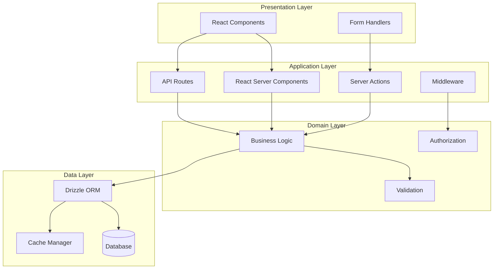
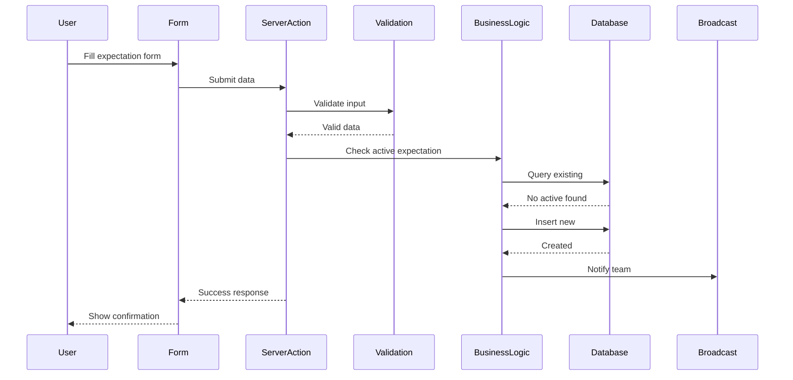
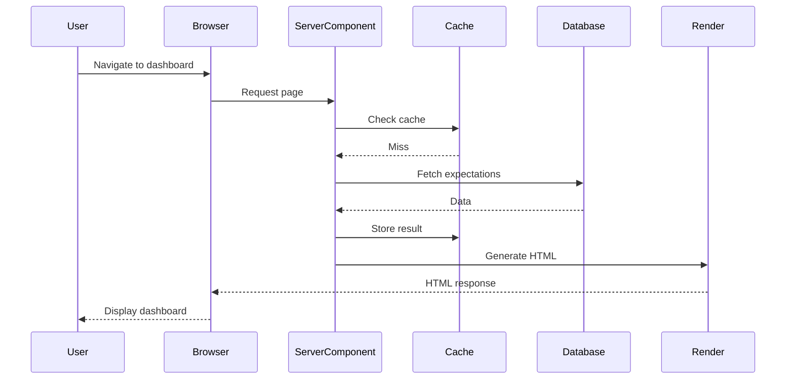

# Service Boundaries and Communication Patterns

## Architectural Layers



## Service Boundaries

### 1. Presentation Layer
**Responsibility**: User interface and interaction

**Components**:
- React Client Components
- Form components with client validation
- Real-time UI updates
- Loading and error states

**Boundaries**:
- No direct database access
- No business logic
- Only presentation logic
- Communicates via Server Actions/API

### 2. Application Layer
**Responsibility**: Request handling and orchestration

**Components**:
- Server Components for data fetching
- Server Actions for mutations
- API routes for external access
- Middleware for cross-cutting concerns

**Boundaries**:
- No UI rendering logic
- Delegates to domain layer
- Handles HTTP concerns
- Session management

### 3. Domain Layer
**Responsibility**: Business rules and logic

**Components**:
- Business rule enforcement
- Complex validations
- Authorization checks
- Domain events

**Boundaries**:
- Framework agnostic
- No HTTP concerns
- No database queries
- Pure business logic

### 4. Data Layer
**Responsibility**: Data persistence and retrieval

**Components**:
- ORM query builders
- Database migrations
- Caching strategies
- Connection management

**Boundaries**:
- No business logic
- Only data operations
- Abstracted database access
- Transaction management

## Communication Patterns

### 1. Server Component Pattern
```typescript
// app/dashboard/page.tsx
export default async function DashboardPage() {
  // Direct database access in server component
  const expectations = await getActiveExpectations()
  
  return <ExpectationsList expectations={expectations} />
}
```

### 2. Server Action Pattern
```typescript
// app/actions/expectations.ts
export async function createExpectation(formData: FormData) {
  // Validation
  const validated = await validateExpectation(formData)
  
  // Authorization
  const user = await getCurrentUser()
  if (!user) throw new Error('Unauthorized')
  
  // Business logic
  const canCreate = await checkActiveExpectation(user.id)
  if (!canCreate) throw new Error('Active expectation exists')
  
  // Persistence
  return await db.insert(expectations).values(validated)
}
```

### 3. API Route Pattern
```typescript
// app/api/expectations/route.ts
export async function GET(request: Request) {
  // Authentication
  const session = await getSession(request)
  if (!session) return new Response('Unauthorized', { status: 401 })
  
  // Query parsing
  const { searchParams } = new URL(request.url)
  const status = searchParams.get('status')
  
  // Data fetching
  const data = await getExpectations({ status, userId: session.userId })
  
  return Response.json(data)
}
```

### 4. Real-time Pattern
```typescript
// Real-time subscription for active expectations
const subscription = supabase
  .channel('expectations:active')
  .on('postgres_changes', {
    event: '*',
    schema: 'public',
    table: 'expectations',
    filter: 'is_done=eq.false'
  }, handleExpectationChange)
  .subscribe()
```

## Data Flow Examples

### Creating an Expectation


### Viewing Team Dashboard


## Error Handling Strategy

### Layer-Specific Handling
1. **Presentation**: User-friendly error messages
2. **Application**: HTTP status codes and error responses
3. **Domain**: Business rule exceptions
4. **Data**: Database constraint violations

### Error Propagation
```typescript
// Domain error
class ActiveExpectationExistsError extends Error {
  constructor(userId: string) {
    super(`User ${userId} already has an active expectation`)
    this.name = 'ActiveExpectationExistsError'
  }
}

// Application layer handling
try {
  await createExpectation(data)
} catch (error) {
  if (error instanceof ActiveExpectationExistsError) {
    return { 
      success: false, 
      error: 'You already have an active expectation' 
    }
  }
  throw error // Unexpected errors
}
```

## Performance Optimization

### Caching Strategy
- **Server Component Cache**: 60s for dashboard
- **Database Query Cache**: Via Drizzle prepared statements
- **CDN Cache**: Static assets and images
- **Browser Cache**: API responses with ETags

### Query Optimization
- Indexed queries for common patterns
- Eager loading for related data
- Query result limiting
- Connection pooling