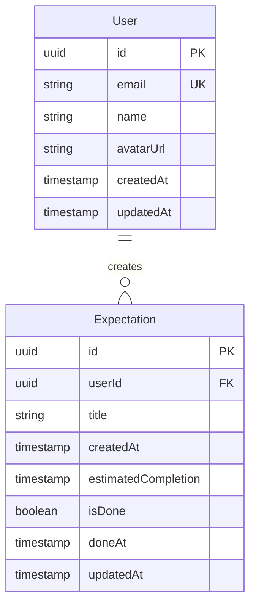

# Data Architecture

## Entity Relationship Model



## Core Entities

### User Entity
Primary entity representing team members.

**Attributes:**
- `id`: UUID primary key (generated)
- `email`: Unique email address (from Clerk auth)
- `name`: Display name
- `avatarUrl`: Profile image URL (nullable)
- `createdAt`: Account creation timestamp
- `updatedAt`: Last modification timestamp

**Constraints:**
- Email must be unique
- Name required, max 100 characters
- Avatar URL must be valid URL format

### Expectation Entity
Represents work commitments with time estimates.

**Attributes:**
- `id`: UUID primary key (generated)
- `userId`: Foreign key to User (required)
- `title`: Task description (required, max 500 characters)
- `createdAt`: Creation timestamp
- `estimatedCompletion`: Expected completion timestamp
- `isDone`: Boolean completion status (default: false)
- `doneAt`: Actual completion timestamp (nullable)
- `updatedAt`: Last modification timestamp

**Constraints:**
- One active (non-done) expectation per user
- EstimatedCompletion must be future timestamp at creation
- DoneAt must be after createdAt when set
- Title cannot be empty

## Data Integrity Rules

### Business Constraints
1. **Single Active Expectation**: Each user can have maximum one expectation where `isDone = false`
2. **Ownership**: Users can only modify their own expectations
3. **Immutable History**: Completed expectations cannot be deleted, only archived
4. **Time Consistency**: Timestamps must maintain logical order

### Referential Integrity
- Cascade user deletion to expectations (soft delete)
- Prevent user deletion with active expectations
- Foreign key constraints enforced at database level

## JSON Schemas

### User Schema
```json
{
  "$schema": "http://json-schema.org/draft-07/schema#",
  "type": "object",
  "required": ["id", "email", "name", "createdAt", "updatedAt"],
  "properties": {
    "id": {
      "type": "string",
      "format": "uuid"
    },
    "email": {
      "type": "string",
      "format": "email"
    },
    "name": {
      "type": "string",
      "minLength": 1,
      "maxLength": 100
    },
    "avatarUrl": {
      "type": ["string", "null"],
      "format": "uri"
    },
    "createdAt": {
      "type": "string",
      "format": "date-time"
    },
    "updatedAt": {
      "type": "string",
      "format": "date-time"
    }
  }
}
```

### Expectation Schema
```json
{
  "$schema": "http://json-schema.org/draft-07/schema#",
  "type": "object",
  "required": ["id", "userId", "title", "createdAt", "estimatedCompletion", "isDone", "updatedAt"],
  "properties": {
    "id": {
      "type": "string",
      "format": "uuid"
    },
    "userId": {
      "type": "string",
      "format": "uuid"
    },
    "title": {
      "type": "string",
      "minLength": 1,
      "maxLength": 500
    },
    "createdAt": {
      "type": "string",
      "format": "date-time"
    },
    "estimatedCompletion": {
      "type": "string",
      "format": "date-time"
    },
    "isDone": {
      "type": "boolean"
    },
    "doneAt": {
      "type": ["string", "null"],
      "format": "date-time"
    },
    "updatedAt": {
      "type": "string",
      "format": "date-time"
    }
  }
}
```

## Data Access Patterns

### Query Patterns
1. **Active Expectations**: Filter by `isDone = false`, join with users
2. **Team Dashboard**: All active expectations except current user
3. **History View**: Filter by `isDone = true`, order by `doneAt DESC`
4. **User Expectations**: Filter by `userId`, single active check

### Index Strategy
- Primary: `id` (both tables)
- Unique: `users.email`
- Composite: `expectations(userId, isDone)` for active check
- Single: `expectations.doneAt` for history sorting