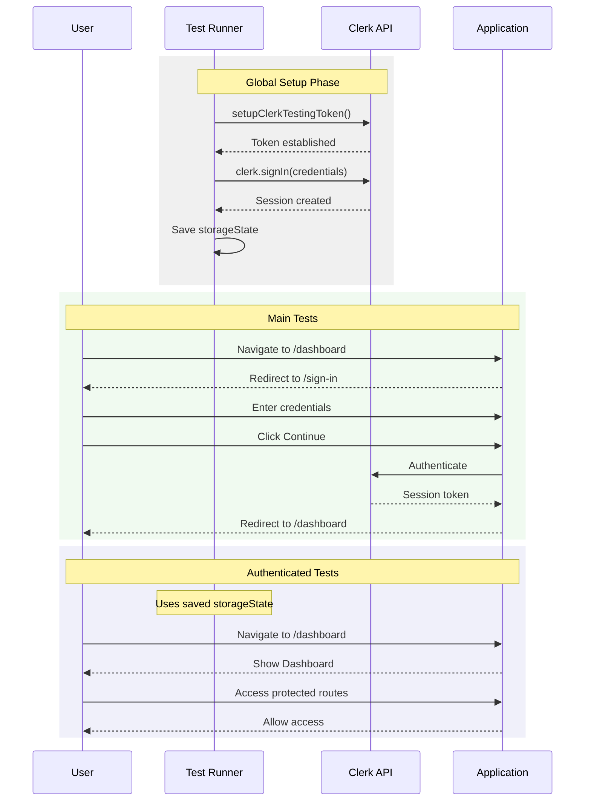

# Authentication Tests

## Test Coverage



### Description
Authentication testing follows Clerk's official testing pattern. Global setup establishes a testing token and saves authenticated session state. Main tests verify sign-in/out flows. Authenticated tests use pre-saved session state to test protected routes.

## Test Specifications

### Global Setup (`e2e/global.setup.ts`)
- Validates environment variables
- Establishes Clerk testing token via `clerkSetup()`
- Authenticates test user
- Saves session to `playwright/.clerk/user.json`

### Main Tests (`e2e/app.spec.ts`)
| Test | Purpose | Verification |
|------|---------|--------------|
| `sign in` | Manual sign-in flow | Form submission, redirect to dashboard |
| `sign in using helper` | Clerk helper method | `clerk.signIn()`, dashboard access |
| `sign out using helpers` | Sign-out flow | `clerk.signOut()`, redirect to sign-in |

### Authenticated Tests (`e2e/authenticated.spec.ts`)
| Test | Purpose | Verification |
|------|---------|--------------|
| `already signed in` | Session persistence | Direct dashboard access |
| `can access protected routes` | Route protection | UserButton presence |

## Environment Configuration

Required variables in `.env.test`:
```
E2E_CLERK_USER_USERNAME=demo@example.com
E2E_CLERK_USER_PASSWORD=<secure_password>
NEXT_PUBLIC_CLERK_PUBLISHABLE_KEY=<clerk_key>
CLERK_SECRET_KEY=<clerk_secret>
```

## Selectors

| Element | Selector |
|---------|----------|
| Sign-in form | `.cl-signIn-root` |
| Email input | `input[name=identifier]` |
| Password input | `input[name=password]` |
| Continue button | `button[name="Continue"]` |
| User button | `.cl-userButtonTrigger` |
| Dashboard heading | `h1:has-text('Dashboard')` |