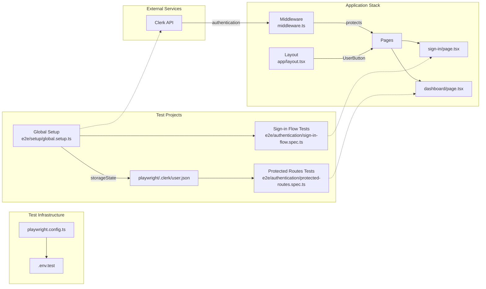
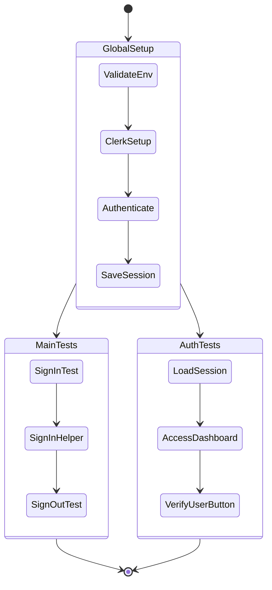
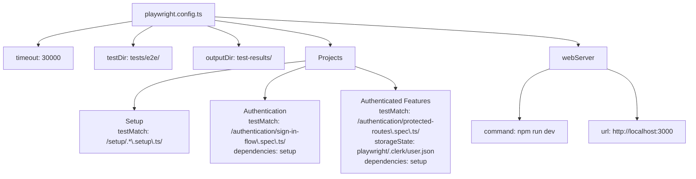

# Test Architecture

## System Architecture

### Description
The test architecture follows a three-project structure with dependency management. Global setup authenticates once and saves session state. Main tests verify authentication flows. Authenticated tests reuse saved session state for protected route testing. The application uses Clerk middleware for route protection.

## Test Execution Flow

### Description
Test execution starts with global setup that validates environment, sets up Clerk testing token, authenticates, and saves session. Main tests and authenticated tests run in parallel after global setup completes. Tests complete with 7 total test cases.

## Component Mapping

| Application Component | Test Coverage | Test File |
|----------------------|---------------|-----------|
| `/middleware.ts` | Route protection | `e2e/authentication/protected-routes.spec.ts` |
| `/app/sign-in/` | Sign-in flow | `e2e/authentication/sign-in-flow.spec.ts` |
| `/app/dashboard/` | Protected access | `e2e/authentication/protected-routes.spec.ts` |
| `UserButton` | Authentication state | `e2e/authentication/protected-routes.spec.ts` |

## Configuration Structure

### Description
Playwright configuration defines three test projects with dependencies. Global timeout is 30 seconds. Web server runs development server on port 3000. Test results output to test-results directory. Authenticated tests use saved storage state from global setup.