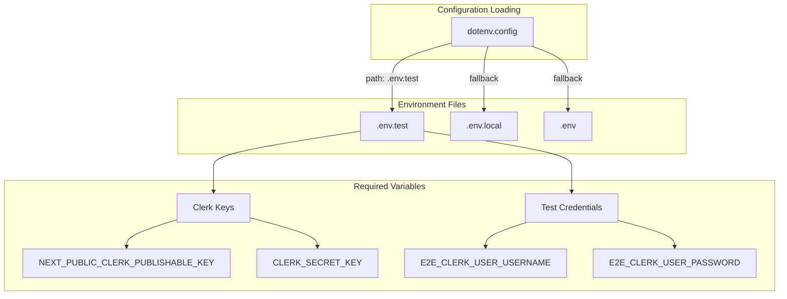
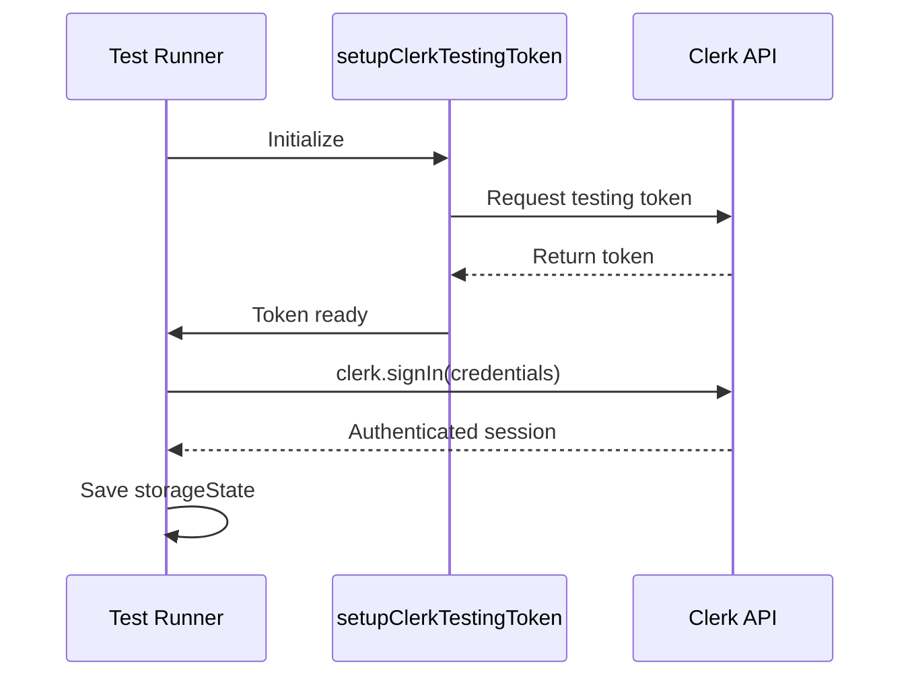

# Test Configuration

## Environment Setup



### Description
Test environment configuration uses `.env.test` as primary source. Dotenv loads configuration at test startup. Clerk keys and test credentials are required for authentication. Configuration validation occurs in global setup before test execution.

## Playwright Configuration

### Core Settings
```typescript
timeout: 30000              // 30 second global timeout
testDir: "e2e"             // Test directory
outputDir: "test-results/" // Results output
```

### Web Server
```typescript
webServer: {
  command: "npm run dev",
  url: "http://localhost:3000",
  reuseExistingServer: !process.env.CI
}
```

### Test Projects

| Project | Purpose | Dependencies | Storage State |
|---------|---------|--------------|---------------|
| `global setup` | Authentication setup | None | Saves to `playwright/.clerk/user.json` |
| `Main tests` | Sign-in/out flows | `global setup` | None |
| `Authenticated tests` | Protected routes | `global setup` | Uses `playwright/.clerk/user.json` |

## File Structure

```
/
├── .env.test                    # Test environment variables
├── .gitignore                   # Includes playwright/.clerk/
├── playwright.config.ts         # Playwright configuration
├── package.json                 # Test scripts
└── e2e/
    ├── global.setup.ts         # Authentication setup
    ├── app.spec.ts            # Main test scenarios
    └── authenticated.spec.ts   # Protected route tests
```

## Test Commands

| Command | Purpose |
|---------|---------|
| `npm run test:e2e` | Run all E2E tests |
| `npm run test:e2e:ui` | Run tests with UI mode |
| `npm run test:e2e:debug` | Run tests in debug mode |

## Security Configuration

### Git Ignored Files
```
playwright/.clerk/     # Session storage
test-results/         # Test outputs
.env.test            # Environment variables
```

### Session Storage
- Location: `playwright/.clerk/user.json`
- Contains: Cookies, localStorage, session tokens
- Lifecycle: Generated during global setup, consumed by authenticated tests
- Security: Never committed to version control

## Clerk Testing Configuration



### Description
Clerk testing uses official `@clerk/testing` library. Setup establishes testing token to bypass bot protection. Authentication uses real Clerk API with test credentials. Session state persists across test runs for efficiency.