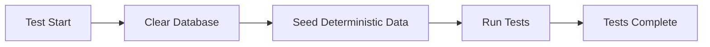

# Test Database Strategy

## Overview
This document outlines our test database management strategy for E2E and API tests.

## Principles
1. **Deterministic Data**: Same data every test run
2. **Isolation**: Tests don't affect each other
3. **Speed**: Fast setup and teardown
4. **Automation**: No manual intervention required

## Database Setup Flow

### E2E Tests


### Test Data Structure
- **5 Test Users** (deterministic, always same IDs)
- **6 Expectations** (4 active, 2 completed)
- **Fixed Seed**: `5318008` ensures reproducibility

## Running Tests

### With Database Setup (CI/CD, Fresh Environment)
```bash
# E2E Tests - will setup database
npm run test:e2e

# API Tests - will setup database  
npm run test:api
```

### Without Database Setup (Local Development)
```bash
# When database is already set up
SKIP_DB_SETUP=true npm run test:e2e:ui

# Or use the convenience command
make tdd-e2e
```

## Test User Data

### Always Available Test Users
| User | Email (Generated) | Active Expectations | Purpose |
|------|------------------|-------------------|----------|
| User 1 | Deterministic | 1 (urgent) | Test urgent tasks |
| User 2 | Deterministic | 1 (normal) | Test standard flow |
| User 3 | Deterministic | 1 (normal) | Test multiple users |
| User 4 | Deterministic | 0 (2 completed) | Test history view |
| User 5 | Deterministic | 1 (future) | Test future dates |

## Special Test Scenarios

### Demo User Population
For testing the populate-user script with specific scenarios:
```bash
# Populate specific test user with random data
npm run populate-user -- --email test1@example.com
```

## Database Connection Issues

### Common Issues & Solutions

1. **WSL2 Connection Timeout**
   - Use `SKIP_DB_SETUP=true` for local development
   - Database might already be set up from previous run

2. **Supabase Pooler Limits**
   - Connection string includes `pgbouncer=true&connection_limit=1`
   - Prevents connection pool exhaustion

3. **CI/CD Environment**
   - Always runs full setup (never skips)
   - Uses fresh database for each pipeline run

## Best Practices

### DO ✅
- Use deterministic seed data for tests
- Clear database before each test suite
- Use the same test data structure across all test types
- Document special test users and their purposes

### DON'T ❌
- Manually populate test database
- Use random/changing test data
- Share test database with development
- Modify test data during test execution

## Troubleshooting

### Test Database Not Connecting
```bash
# Check connection
npm run db:push:force

# If timeout, database might be fine
SKIP_DB_SETUP=true npm run test:e2e:ui
```

### Wrong Test Data
```bash
# Reset test database
npm run db:clean
npm run db:seed:test
```

### Need Fresh Data for Specific Test
```bash
# Use the populate-user script for one-off scenarios
npm run populate-user -- --user-id <uuid>
```