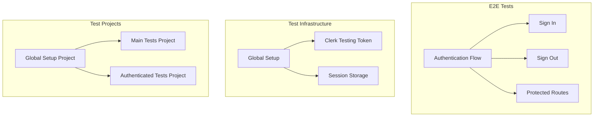

# TDD Documentation Map

## Navigation Hub

| Document | Purpose |
|----------|---------|
| [Authentication Tests](./authentication.md) | Clerk authentication E2E test specifications |
| [Test Configuration](./configuration.md) | Playwright and test environment setup |
| [Test Architecture](./architecture.md) | Test structure and patterns |

## Test Coverage Overview



### Description
The test suite uses Playwright with Clerk's official testing approach. Tests are organized into three projects: global setup for authentication, main tests for sign-in flows, and authenticated tests for protected routes. Each project depends on the global setup which establishes the testing token and saves session state.

## Test Files Structure

```
tests/
└── e2e/
    ├── setup/
    │   └── global.setup.ts              # Technical setup for authentication
    ├── authentication/
    │   ├── sign-in-flow.spec.ts        # Sign-in/out user journeys
    │   └── protected-routes.spec.ts    # Authenticated access tests
    └── [future features]/
        ├── expectations/                # To be added for expectations feature
        └── history/                     # To be added for history feature
```

## Quick Reference

- **Timeout**: 30 seconds global timeout
- **Environment**: `.env.test` configuration
- **Session Storage**: `playwright/.clerk/user.json`
- **Test Command**: `npm run test:e2e`